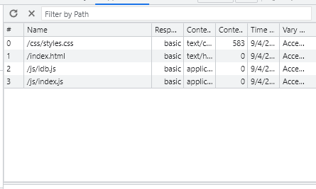
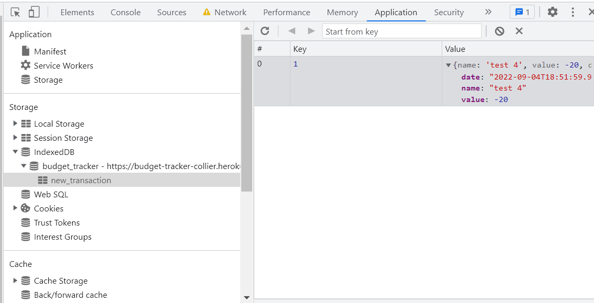

# Budget Tracker

# Description

This is an app that is designed to allow users to track expenses. The user will input the value of the transaction and then determine whether that transaciton was an expense or a deposit. Once the user enters the transaction, then it is uploaded to the database and is represented in the grid and on the graph below the grid.

Additionally, this app contains all of the features necessary for offline functionality. This application contains a web manifest which allows this application to be a Progressive Web Application. This application contains a service worker that caches files so that the page can continue operating when offline. The page also contains a web manifest that allows the user to download the application as an application on their mobile phone or their computer. Finally, this application contains a javascript file that saves data to IndexedDB in the case that the database is offline.

# Images

# Link

https://budget-tracker-collier.herokuapp.com/
